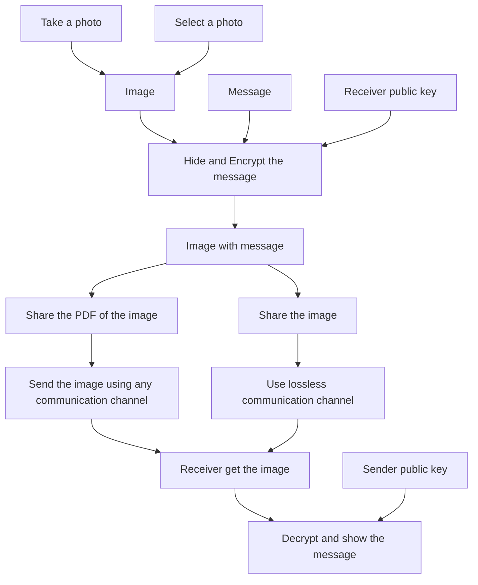

# 👻 Ghost text
This project aims to protect the privacy of text messages using steganography techniques (LSB), by hiding the message inside an image.

Usually when we think about message security and privacy, we first think about encription and how it can be used to make a text message a secret. The problem of this approach is that we can see the exchange of messages. The steganography solve this problem by hiding the existance of the message by inserting it inside another one and using it as transport to reach the destination.

Ghost Text use steganography techniques to insert text messages inside photos that are indistinguishable from the original one. Before inserting the message, to increase to security even more, we encrypt it using an RSA key.

### ⚒ Features
* Create RSA key to encrypt messages
* Choose the image from gallery or take a photo
* Support every type of messaging app
* Support PDF and PNG output
* Light and dark theme
* And much more...

### ⛓ Pipeline

### Contribution
Created by Francesco Della Casa.
